# Learning - How DoorDash Built a Centralized Gateway for AI Agent-Tool Access (S29)

> Personas: **curator + mentor** (distilling and teaching), **fact-checker** (the gate),
> **presenter** (the diagram walkthroughs and the closing narrative). Re-adopt when working this
> file.
>
> **Voice:** an AI architect ramping up a senior engineer who is new to this subject. Strong
> engineer, no hand-holding, but assume nothing about MCP, OAuth or platform design.
>
> **Trust posture, stated once at the top because it colours everything below.** This is a vendor
> engineering-brand post. The architecture is described honestly and in reasonable detail. Every
> number in it is first-party, unaudited, and measures the platform's own reach rather than any
> outcome. Read the design as instructive and the adoption block as a claim.

## TL;DR

MCP gave agents and tool servers a shared way to describe, discover and invoke capabilities, and
DoorDash found that solved the least interesting part of the problem. Once agents moved from
experiments into real workflows, the questions that decided whether a call should happen at all lived
entirely outside the protocol, and every team was answering them again from scratch. Their response
was an Agent Gateway that all agent-tool traffic passes through, which authenticates the caller,
evaluates a five-part authorization tuple, assembles a curated tool catalog from several downstream
servers, injects a credential the agent never sees, forwards the call, and emits one structured usage
event. The reusable idea is not the gateway topology, which is unremarkable. It is that **the
discovered tool catalog is an interface somebody has to author**, and that a governed path only gets
used if it is more convenient than the ungoverned one.

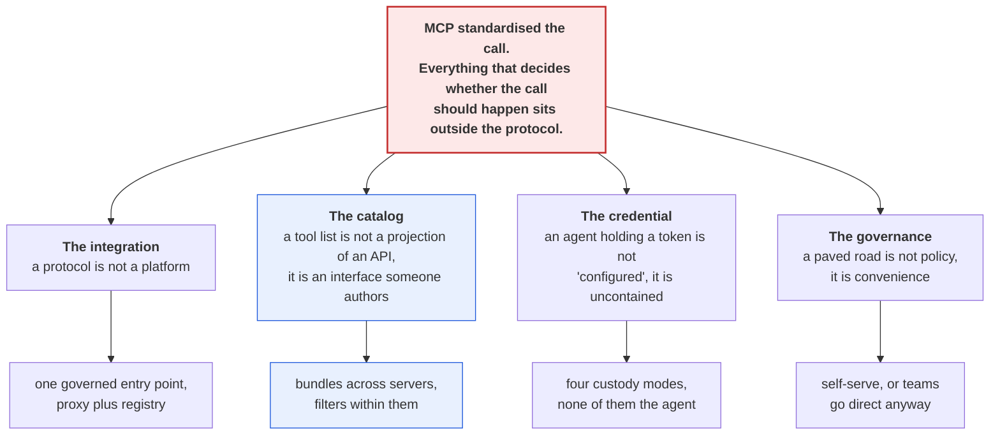

This is a collapse diagram rather than an architecture diagram, so nothing in it is a component and
no arrow is a request. **Each of the four branches is a thing that gets mistaken for a smaller thing,
and the gateway is what falls out of taking all four seriously at once.** It is shaped as one root
with four independent consequences because that is the source's actual argument, which is that these
are not four problems to be sequenced but one problem seen from four angles, and a team that fixes
only the credential branch has built a secret store rather than a platform. The catalog branch is
coloured because it is the one this brain judges most transferable, and it is the branch the source
itself elevates to a general lesson. Synthesized from `n1`, `n5`, `n13`, `n17`.

## The 1-minute version

This article describes an internal platform that DoorDash built so that AI agents inside the company
could reach roughly 200 tool servers without each agent team solving identity, credentials, tool
selection and observability by itself. It is written by the two engineers who built it, three weeks
after the fact, and it is the consumer-side counterpart to the server-side story this brain already
holds from GitHub in [S27](../260816_scaling-github-for-agents/LEARNING.md).

The problem it works on begins where MCP stops. The protocol settled the shape of a tool call, which
is genuinely valuable, and it deliberately says nothing about which agent may make that call, whom
the agent is acting for, which credential should be attached, which subset of tools the agent should
even be shown, how access is withdrawn, or what record survives afterwards. Those six questions are
the entire operational surface of a tool call, and none of them is a protocol question.

What makes the problem hard is that the six questions do not decompose the way an engineer first
expects. They look like six features to build, and they are actually three, because access, catalog
curation and operations each recur identically at every agent-tool pairing. Worse, the natural place
to answer them is the wrong one twice over. Answering them in the agent means the security decision
lives in a prompt or in application code that the model can influence. Answering them in each tool
server means every server author reimplements OAuth, and a third-party server you do not control
cannot be made to answer them at all.

The obvious response is a shared library, and it fails for a reason worth naming. A library ships to
whoever imports it, which means the security posture of the fleet is the intersection of everybody's
upgrade discipline, and there is no point at which anyone can revoke anything. A gateway is the same
logic relocated to a place with a different property, which is that traffic has to traverse it. That
relocation is the whole idea, and the cost of it is a hop that every tool call now depends on.

The idea, then, is a single governed entry point split into two planes. A proxy sits on the data path
and runs the same pipeline for every request. A registry holds the control-plane truth about servers,
agents, owners, transports, auth modes, policies, discovered catalogs and tool-surface configuration.
The proxy is deliberately boring and the registry is where the organisation's decisions actually live.

How it works is more interesting on the discovery path than the invocation path. An agent connects to
one bundle URL rather than to several servers, and the gateway fans `tools/list` out across the
servers in that bundle, applies authorization and per-tool filters, namespaces the surviving tool
names, and returns a single merged catalog. When the agent later calls a tool, the same policy is
evaluated again and the appropriate credential is injected from one of four custody modes, none of
which is the agent holding the secret. A missing OAuth grant is treated as an ordinary state rather
than an error, so the gateway holds the call open, elicits consent in-protocol, and then replays the
original call.

What it costs is mostly unstated, and the gaps are specific. Every tool call now depends on a
component the article never gives a latency, availability or failure number for. The proxy reads a
*cached* copy of policy from the registry, which the figure shows and the prose never mentions, so
central revocation is central authorship with an unbounded propagation window. And the curation that
makes agents better is manual approval work that scales with the tool count, performed by people who
must decide, per tool, what an agent should be allowed to do.

How far to trust it comes down to separating the design from the numbers. The design is checkable
against this brain's existing evidence and it converges with it from an independent direction, which
is the strongest thing about the source. The numbers are first-party counts of the platform's own
reach, published on a careers site, and not one of them measures whether agents got better, cheaper
or safer.

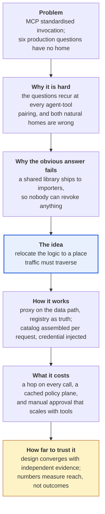

This is an argument diagram rather than a system diagram, so the boxes are the beats of the reasoning
and not parts of the gateway. **The pivot is the third box, because the move from library to gateway
is not a change of logic but a change of location, and everything the platform can do afterwards
follows from having picked a location that traffic cannot avoid.** It runs as a single unbranched
chain because the source's reasoning genuinely does not branch, and drawing alternatives here would
suggest DoorDash weighed options they never describe weighing. The trust box is coloured separately
because it is the only beat where this brain's reading and the source's own account diverge. Compare
it with the TL;DR diagram above, which draws where the argument lands rather than how it travelled.

The table below is the same arc compressed for scanning, and it is here for the reader returning to
check one row rather than the reader arriving.

| | |
|---|---|
| **The problem** | MCP standardised the shape of a tool call and answered none of the six questions that decide whether the call should happen: which agent, for whom, with which credential, seeing which tools, revoked how, recorded where [n1]. |
| **Why it is hard** | The six questions recur identically at every agent-tool pairing, and both obvious homes are wrong. In the agent, the security decision sits in a prompt. In each tool server, every author reimplements OAuth and third-party servers cannot be made to comply at all [n2]. |
| **Why the obvious answer fails** | A shared library reaches only the teams that import and upgrade it, and offers no point of revocation. This brain already holds the general form as claim 217: the only lever that reaches a whole population is what arrives when nobody acts. |
| **The idea** | One governed entry point, split into a proxy on the data path and a registry holding control-plane truth. The proxy authenticates, authorizes, rate-limits, injects a credential, forwards, and emits a usage event [n3]. |
| **How it works** | Bundles present one MCP endpoint whose catalog is assembled per request by fanning `tools/list` across several servers, filtering, and namespacing [n10]. The same policy is enforced again at `tools/call` [n12]. Four credential custody modes, none of them the agent [n5]. A missing OAuth grant is elicited in-protocol and the original call is replayed [n7]. |
| **What it costs** | Unstated by the source, and the specifics matter. No latency, availability or failure figure for a component now on the path of every tool call. A cached policy plane the prose never mentions [n4]. Per-tool manual approval that scales with the catalog [n11]. |
| **How far to trust it** | Design: reasonably, and it converges independently with claims 221 and 224 from a different vantage. Numbers: as vendor self-report only. Every one of them counts the platform's reach, and none measures an outcome [n16]. |

## Key claims

- **MCP solves invocation, not governance.** Six production questions sit outside the protocol, and
  the gateway's five-step pipeline is precisely the layer wrapped around the forward step [n1].
  `corroborated`
- **The problem is three problems, not six**: access, tool-surface curation, and operations, each of
  which otherwise gets rebuilt at every agent-tool pairing [n2]. `corroborated`
- **The proxy is the data plane and the registry is the source of truth**, holding servers, agents,
  owners, transports, auth modes, policies, discovered catalogs and tool-surface configuration [n3].
  `corroborated`
- **Authorization is a five-part tuple, not a pair** - agent to server, user to tool through this
  agent, tool in this environment, write-capable versus read-only variant, and team principal versus
  per-user OAuth [n6]. `corroborated`
- **Four credential custody modes, and the agent is never one of them** - internal service identity,
  gateway-held token, per-user OAuth in an encrypted grant store, and brokered short-lived service
  principals [n5]. `single-leg` on the taxonomy, and the principle is the transferable half.
- **A missing OAuth grant is a normal state, not an exception.** The gateway holds the call open,
  elicits consent in-protocol, and replays the original call, turning a dropped turn into a prompt
  [n7, n9]. `corroborated`
- **A bundle is one MCP endpoint whose catalog is assembled at request time** by fanning `tools/list`
  across several servers, filtering, namespacing, and merging [n10]. `corroborated`
- **What filtering removes has a consistent shape: destructive and administrative verbs.** The figure
  names them at tool granularity, and every denied entry is a delete, a transfer, or a permission
  change [n11]. `corroborated`, and the figure is materially more specific than the prose.
- **Discovery and invocation enforce the same policy**, so the visible catalog and the callable set
  cannot drift apart [n12]. `corroborated`
- **The paved road has to win on convenience, not on policy.** Governance requiring tickets does not
  scale, and the competitor is copying a secret into an agent [n17]. `corroborated` as a design
  commitment; the evidence that it worked is entirely n16.
- **Adoption, as self-reported**: 200+ MCP servers, 30+ agents and services, thousands of employees,
  millions of tool calls a week, and no agent holding a raw credential [n16]. `single-leg, vendor
  self-report`, and every figure counts reach rather than outcome.
- **Two findings the figures carry and the prose does not.** Agents appear as downstream targets
  alongside MCP servers, which makes agent-to-agent calls traverse the same governed path unremarked.
  And a cache sits between registry and proxy, which bounds "one place to revoke" with a propagation
  window nobody names [n4, and the divergence table in `nodes.md`]. `single-leg, figure only`

## What you will learn, and in what order

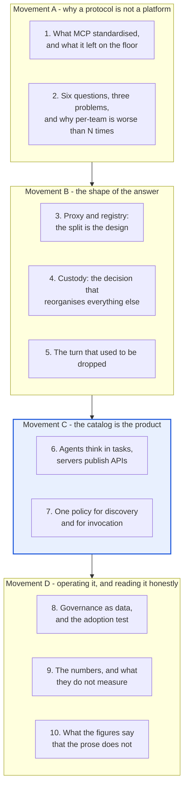

This is a reading-order diagram about the note rather than about the gateway, and the colour marks
the movement carrying the payload. **Movement C is the part worth your full attention, because
everything in it transfers to any organisation running agents against tool servers, whether or not
they ever build a gateway.**

Movement A sets up the problem and is the part a reader who already knows MCP can move through
quickly, though section 2 is worth slowing for, because the reason a shared library fails here is the
same reason configuration flags failed for GitHub and it is easy to miss. Movement B walks the
architecture, and its cost to skim is that section 4 contains the single decision from which the rest
of the design follows, so skimming it leaves you with a topology and no rationale. Movement C is the
payload, and it is short because the ideas in it are sharp rather than numerous. Movement D is where
this note stops agreeing with its source, which makes it the part to read if you intend to cite S29
anywhere, and the part to skip if you only want the design.

## Movement A - why a protocol is not a platform

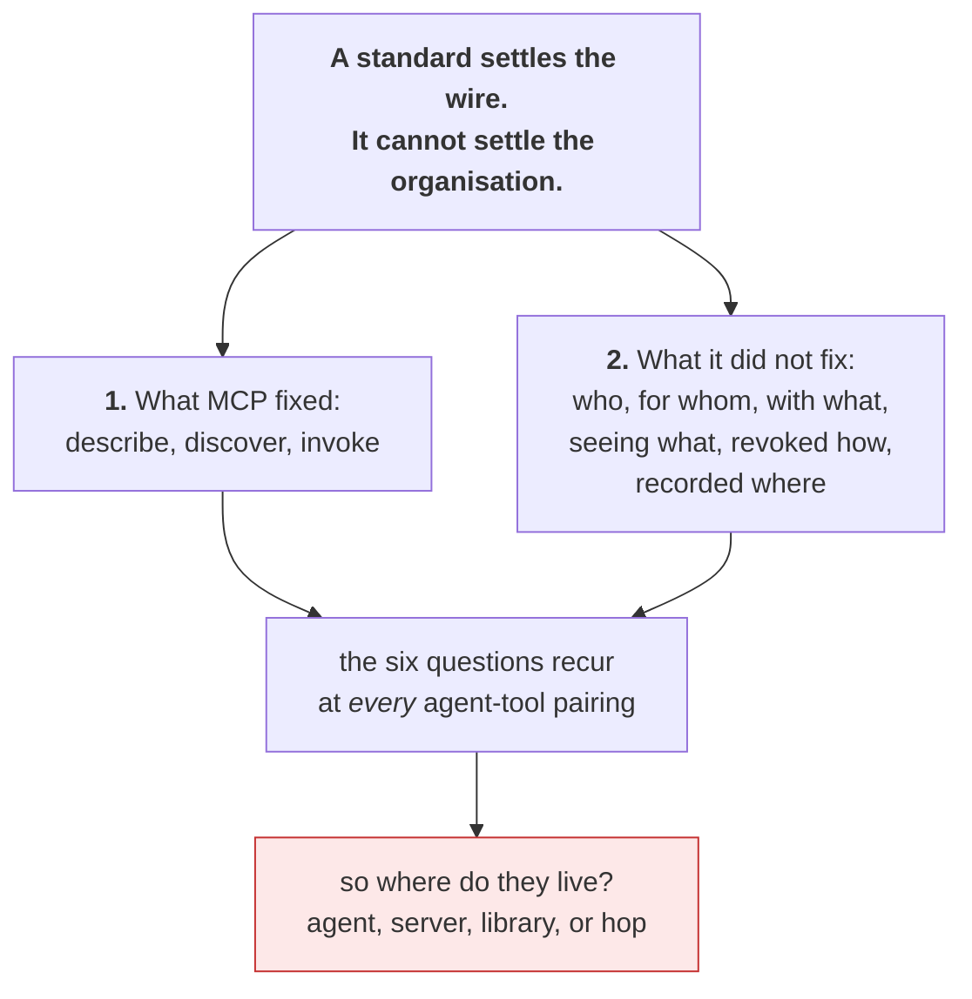

This is a problem-decomposition diagram, not an architecture one, so the boxes are questions rather
than components. **The movement exists to establish one thing: the six unanswered questions are not
gaps in MCP but a different category of problem that no wire protocol could have solved.** It
converges on a single red question because the whole of Movement B is an answer to that one question,
and a reader who arrives at Movement B without having felt the four candidate homes will read the
gateway as an arbitrary choice rather than as the only remaining one. Synthesized from `n1`, `n2`.

### 1. What MCP standardised, and what it left on the floor

Begin with what the protocol actually bought, because the article's argument is a compliment to MCP
rather than a complaint about it. The Model Context Protocol gave agents and tool servers a shared
way to describe capabilities, discover them, and invoke them, which means an agent author and a tool
author who have never spoken can integrate [n1]. That is a real and substantial win, and it is worth
holding onto while reading the rest, because the failure this article describes is a failure of
success. Tools became easy to expose, so people exposed them.

> **Background, supplied.** This paragraph is scaffolding I am providing so the rest reads, and it is
> uncited by construction because S29 assumes it. MCP is a client-server protocol where a *server*
> publishes tools and a *client*, typically inside an agent, lists and calls them. `tools/list`
> returns the catalog of what is available, and `tools/call` invokes one. The catalog matters more
> than it first appears, because everything in it is serialised into the model's context on every
> turn, and a client will not call a tool that was not in the list it received. Skip this if you have
> written an MCP server.

The question the article opens on is what happens when that success arrives inside a company. DoorDash
describes agents reaching internal APIs, engineering systems, observability platforms, ticketing
systems, knowledge bases and third-party SaaS products [n1]. Notice that this list is not a list of
tools. It is a list of *systems with owners*, each of which already has an access model, an audit
requirement and someone whose job it is to know who called it. MCP has nothing to say about any of
that, and it was never supposed to.

So the six questions the article enumerates are worth reading slowly, because they are not a
grab-bag. Which agent is allowed to call this tool, which user or team or service is it acting for,
which credential should be used, which subset of tools should the agent even see, how is access
revoked, and how do we know what happened afterwards [n1]. Every one of them is a question about
*context surrounding the call* rather than about the call. The source later compresses this into a
sentence worth memorising, which is that MCP solves invocation and not governance [n1].

At first glance this looks like a gap in the specification, and it is worth resisting that reading,
because a protocol that answered these questions would be worse rather than better. A wire format
that encoded DoorDash's authorization model would be unimplementable by anyone whose authorization
model differed, which is everyone. The questions are genuinely outside the protocol's remit. That
leaves the harder problem, which is that being outside the protocol's remit does not mean being
outside anyone's remit, and this is where the second section starts.

### 2. Six questions, three problems, and why per-team is worse than N times the work

The first move the article makes is a compression that is easy to read past, and it is the most
useful piece of structure in the source. The six questions collapse into three problems. Access is
who is calling, whether they are allowed, and which credential model applies. Tool-surface curation
is which tools this agent should be shown at all. Operations is rate limits, traces, metrics, usage
events, cost attribution and ownership metadata [n2].

Why does compressing six into three matter? Because six questions look like a backlog and three
problems look like a design. More importantly, the three have different owners in most organisations,
and noticing that is what turns this from an agent problem into a platform problem. Access belongs to
whoever owns identity. Operations belongs to whoever owns the service mesh. Curation belongs to
nobody at all, which is the interesting one, and Movement C is entirely about it.

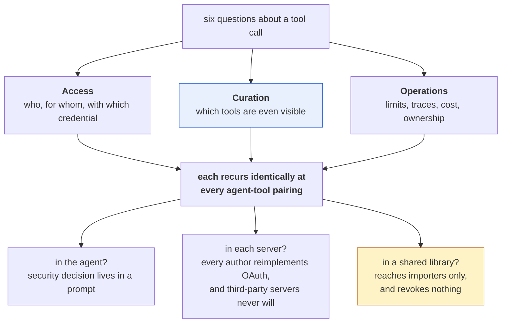

This is an elimination diagram rather than a design one, so the bottom row is three rejected homes
and not three components. **The point is that the three candidate homes fail for three genuinely
different reasons, which is why none of them can be patched into working.** It fans out and then back
in because the argument does exactly that, and the library branch is coloured because it is the one
most engineers reach for and the only one whose failure this brain has independent evidence for.
Synthesized from `n2`, and the library row is this brain's reading rather than the source's.

Now consider where these three could live, because the source states its conclusion without walking
the alternatives, and the alternatives are where the judgement is.

The first candidate is the agent. This is where it lands by default, since the agent is the thing
being built and the thing under deadline. It fails on a point the article makes almost in passing,
which is that agent builders would otherwise be "encoding security decisions in prompts or
application code" [n2]. Take that seriously for a moment. A prompt is a string that a model reads,
and a model reading a string is the exact component this brain has the most evidence about being
manipulable. Putting the authorization decision there means the enforcement point and the
attack surface are the same object.

The second candidate is each tool server. This is more defensible, and it is where OAuth would
traditionally put it, since the resource server is the correct enforcement point in that design. It
fails on arithmetic and on ownership. Every server author reimplements the same identity plumbing,
and roughly nothing you actually want to call is a server you wrote. A third-party SaaS MCP server
cannot be made to understand DoorDash's team structure, its environments, or its read-only variants.

The third candidate is a shared library, and this is the one worth dwelling on because it looks like
it works. A library gets the code written once, which addresses the arithmetic, and it can encode
DoorDash's own model, which addresses the ownership. It fails on distribution. A library reaches
exactly the teams that import it and then upgrade it, so the security posture of the fleet is the
intersection of everybody's dependency hygiene, and there is no moment at which a security team can
withdraw anything from anyone. This brain has already recorded the general form of that failure as
**claim 217**, from GitHub shipping three separate opt-in fixes for tool overload and finding that
everyone used the defaults. The only lever that reaches a whole population is the one that operates
when nobody acts.

| Home | Solves | Fails because |
|---|---|---|
| In the agent | Nothing structural; fastest to ship | The enforcement point becomes a prompt, which is the manipulable component |
| In each tool server | Correct in OAuth's model | N reimplementations, and third-party servers will never encode your org |
| In a shared library | Write-once, and your model | Reaches importers only, upgrades on their schedule, revokes nothing (claim 217) |
| **On a hop traffic must cross** | All three, at once | You now own a component on the path of every tool call |

That last row is the answer, and stating it as a trade rather than a win is the honest framing. The
gateway does not make the three problems easier. It relocates them to somewhere with one property
the other three homes lack, which is that traffic has to go through it whether the calling team
cooperated or not. What that costs is a new dependency in the path of everything, and the article
never prices it. The next movement is what DoorDash built once they accepted that trade.

## Movement B - the shape of the answer

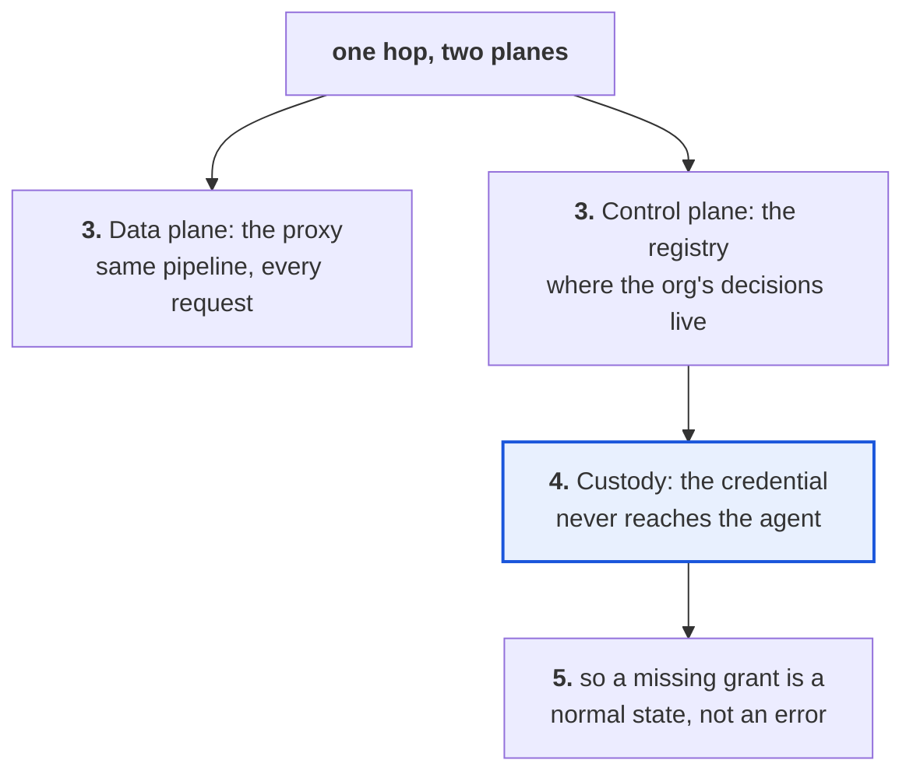

This is a dependency diagram rather than a request-flow one, so the arrows mean "makes possible" and
not "calls". **The movement's spine is that the custody decision in section 4 is what makes section 5
buildable at all, and that relationship is invisible if you read the architecture as a list of
features.** It hangs both sections off the registry rather than the proxy because the proxy is
genuinely boring and the interesting claims all concern where truth is kept. Synthesized from `n3`,
`n5`, `n7`.

### 3. Proxy and registry, and why the split is the design

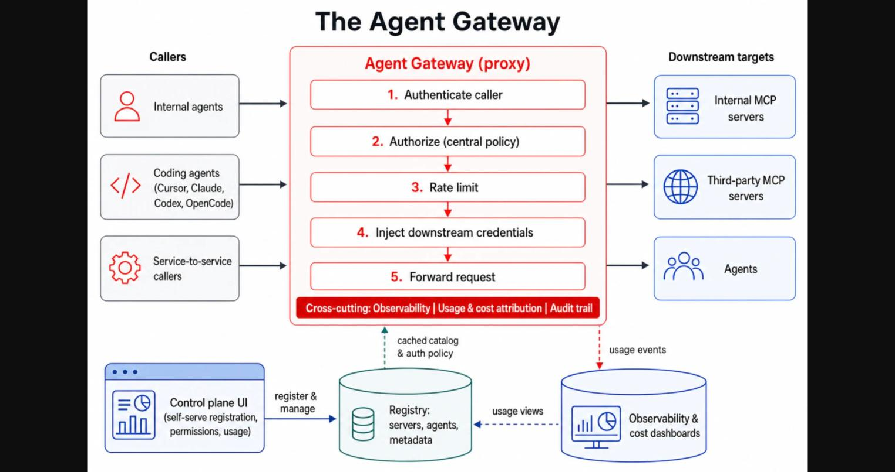

*What it teaches: that the gateway is two components with different lifecycles, and that the proxy's
pipeline is precisely the governance layer MCP omits, wrapped around a forward step.
Corroborated by `n3` and `n1` - the split and the registry's contents are stated in
`§Gateway architecture`, and the five pipeline steps match the six questions from `§Opening`.*

Read the centre column first, because it is the article's whole answer to section 1. The proxy
authenticates the caller, authorizes against central policy, applies rate limits, injects downstream
credentials, and forwards the request, with observability, usage and cost attribution, and an audit
trail drawn as a bar underneath all five [n3, n1]. Now compare that pipeline to the six questions.
Which agent maps to step 1 and step 2, which credential maps to step 4, how do we know what happened
maps to the bar. **The forward step, which is the only part MCP defines, is one of five.** That ratio
is the article's thesis rendered as a picture.

The registry is the half that is easy to underrate. It stores agents, MCP servers, owners, transport
configurations, auth modes, policies, discovered tool catalogs and tool-surface configurations [n3].
Read that list again as an inventory of *decisions* rather than of data. Who owns this server, which
environments may expose this tool, which tools are approved, which agents may see them. The proxy
executes; the registry is where an organisation writes down what it has decided. Splitting them means
those decisions have a lifecycle independent of the request path, which is what lets a security team
change policy without a deploy.

> 💡 **Data plane and control plane.** Borrowed from networking. The data plane is the component
> traffic actually flows through and is optimised for doing one thing per packet, quickly. The
> control plane decides what the data plane should do and is optimised for being correct and
> changeable. The split matters because the two have opposite requirements, and systems that fuse
> them end up needing a deploy to change a policy.

Two details in the figure are worth noticing now and will be paid off in section 10, so hold onto
them. The right-hand column of downstream targets lists internal MCP servers, third-party MCP
servers, and **agents**. And the arrow from the registry up to the proxy is labelled "cached catalog
and auth policy" [n4]. Neither of those is discussed anywhere in the prose. Both change what the
architecture means.

The article also notes, in one sentence and without a picture, that internal and external agentic
traffic run through **separate proxy planes** sharing libraries and registry concepts, to contain
internet-facing blast radius and let each auth model evolve independently [n20]. Take the figure as a
simplification rather than a full topology. That single-leg detail is the one most likely to be
misquoted from this source, since the figure shows one proxy and the text describes at least two.

Which raises the question the figure cannot answer. The pipeline shows a credential being injected at
step 4, and says nothing about where that credential came from or who is trusted to hold it. That is
the next section, and it is the decision the rest of the design hangs off.

### 4. Custody: the one decision that reorganises everything else

Start with the sentence that carries the whole section. Agents should not hold raw credentials, and
the article names the three kinds it means, which are vendor API keys, OAuth refresh tokens, and
borrowed human grants used for team automation [n5]. The third one is the interesting entry, because
it is not a security control that anybody skipped. It is a thing teams do on purpose when a service
account is inconvenient, and it works perfectly until the person leaves.

> **Background, supplied.** Uncited by construction, and skip it if you have implemented OAuth. A
> *refresh token* is a long-lived credential used to mint short-lived access tokens, so possessing
> one is close to possessing the account. A *service principal* is a non-human identity that owns
> permissions in its own right, which is what you want for team automation so the automation does not
> inherit a departing employee's access. The reason "the agent should not hold the credential" is a
> stronger claim than it sounds is that an agent is a process that reads untrusted text and decides
> what to do next, so anything it holds is reachable by anything it reads.

Given that, the article's four custody modes are best read as answers to the question of who holds
the secret, arranged from least to most delegation [n5]. Internal service identity means the platform
already knows the caller and the gateway simply forwards verified caller context, so there is no
secret at all. A gateway-held token means the gateway keeps a vendor or service token in its own
secret storage and injects it without the agent ever seeing it. Per-user OAuth means an encrypted
per-user grant store, from which the gateway injects and refreshes that specific user's token.
A service principal means the gateway mints or brokers short-lived non-personal credentials for team
automation.

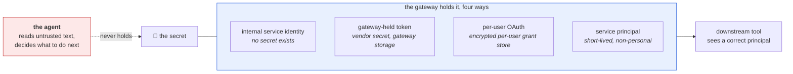

This is a custody diagram, not a sequence, so the dotted line is a boundary that never gets crossed
rather than a call that does not happen. **The four modes are not four features but one principle
applied to four kinds of caller, and the principle is that the component which reads untrusted input
is never the component that holds the secret.** It is drawn with the agent outside the gateway
boundary because that separation is the entire claim, and a diagram placing them side by side would
imply a choice about where to put the token when the design's point is that there is no choice.
Synthesized from `n5`, with the untrusted-input framing taken from this brain's
[agent-security](../../brain/topics/agent-security.md) note rather than from S29.

Notice what this buys beyond the obvious. Because the gateway holds the grant, it also knows whether
a grant exists, which is a piece of information that no other component in the system has. An agent
that holds its own token discovers a missing grant as a 401 in the middle of doing something. A
gateway that holds all the grants can see the absence before the call goes out. That difference
sounds administrative and it turns out to be the difference between a broken turn and a working one,
which is section 5.

### 5. The turn that used to be dropped

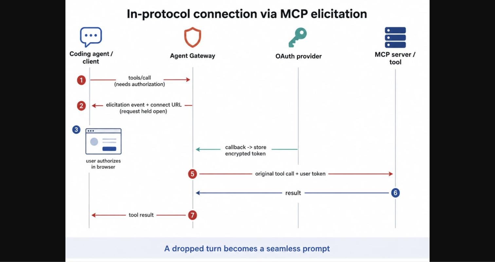

*What it teaches: that an authorization gap can be repaired inside a single tool call rather than
between two sessions, because the gateway holds the original request open across a human round trip.
Corroborated by `n7` - the sequence on the figure and the prose in
`§Per-user OAuth without breaking the agent turn` describe the same seven steps.*

Consider what used to happen, because the improvement is only legible against it. Before the gateway,
each team built its own OAuth flow, its own token storage, and its own "go connect first" experience
[n9]. That last phrase describes a specific and familiar failure. The user asks the agent to do
something, the agent tries, the call fails for want of a grant, and the user is told to go somewhere
else, do a thing, and come back and ask again. The turn is lost, and so, frequently, is the user.

Now read the figure. The client issues a `tools/call` that needs authorization. The gateway replies
with an elicitation event carrying a connect URL, and the figure annotates this step as "request held
open" [n7]. The user authorizes in a browser. The OAuth provider calls back to the gateway, which
stores the encrypted token. The gateway then issues **the original tool call** with the user's token
attached, receives the result, and returns it to the client. The banner across the foot of the figure
states the outcome, which is that a dropped turn becomes a seamless prompt [n9].

The load-bearing detail is step 5, and it is easy to skim. The gateway does not tell the client to
retry. It replays the call it was already holding. That distinction is what makes this a repair
rather than a nicer error, because a retry requires the agent to have kept its intent, and an agent's
intent between turns is exactly the thing that decays.

> 💡 **MCP elicitation.** A protocol capability that lets a server ask the connected client to
> collect something from the human and return it, mid-request. It exists so that a server can ask a
> question without inventing an out-of-band channel. Its limitation is the one every optional
> protocol capability has, which is that a client must implement it.

That limitation is where the honest reading of this section lives. Clients without elicitation
support get a structured authorization-required response with a connect URL instead [n8], which is
the same information delivered as a payload the client has to render itself. The figure draws only
the good path, and the source never says what proportion of clients take which branch, nor what a
client that renders neither actually shows the user. This is `single-leg` and thinly evidenced, so
treat the fallback as a stated intention rather than a demonstrated experience.

The generalisable claim is stated in the lessons and is worth extracting from its context, because it
is not really about OAuth. **Missing grants are normal states, not exceptions** [n9]. Read as a
design principle it says that when a condition occurs on a large fraction of first uses, modelling it
as an error is a category mistake, and the fix is to give it a place inside the protocol rather than
a better message. That reasoning applies to any precondition an agent can discover but not satisfy.

Holding a credential correctly, though, only decides whether a call can be made. It says nothing
about whether the agent should have been offered that call in the first place, and that is where the
source's most transferable material starts.

## Movement C - the catalog is the product

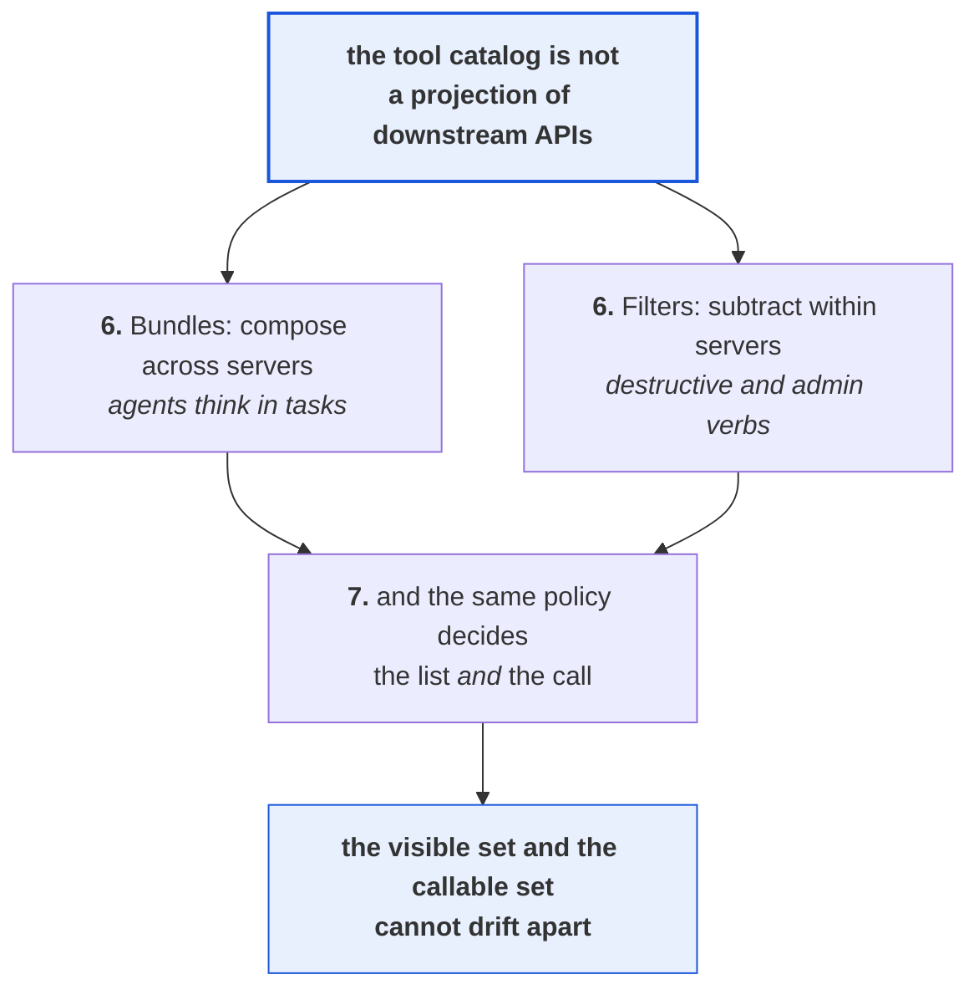

This is a claim diagram rather than a mechanism diagram, so the two middle boxes are the two
operations that make the top claim true and not two subsystems. **Bundles and filters are opposite
operations, addition across servers and subtraction within them, and they are presented together
because either alone produces a catalog that is wrong in a predictable direction.** The convergence
at the bottom is the part most implementations miss, since filtering a list is easy and remembering
to filter the call is the thing that gets forgotten. Synthesized from `n10`, `n11`, `n12`, `n13`.

### 6. Agents think in tasks, and servers publish APIs

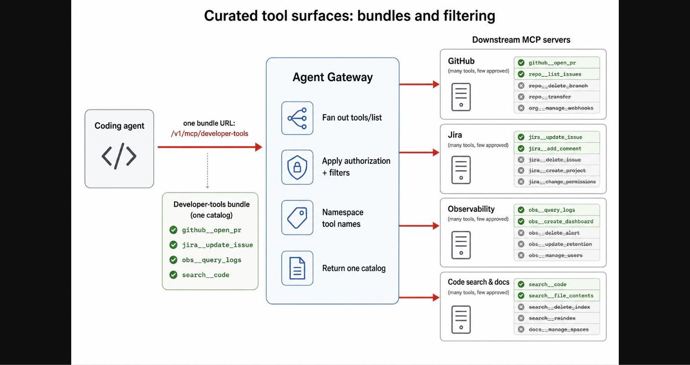

*What it teaches: that a bundle is one endpoint whose catalog is assembled per request from several
servers, and that what gets filtered out is consistently destructive and administrative operations.
Corroborated by `n10` and `n11` - the four gateway steps and the approved-versus-denied split are on
the figure, and `§Curated tool surfaces` describes the same fan-out and names admin, destructive and
billing operations as the categories excluded.*

The framing sentence is the one to keep. Agents do not naturally think in MCP servers, they think in
tasks [n10]. A coding agent investigating an issue does not want GitHub, Jira, observability and docs
as four separate setup steps, because none of those is a step in its actual job. It wants the surface
required to investigate, change code, open a pull request, check CI, and understand production
behaviour. The mismatch is that servers are organised by *who built them* and tasks are organised by
*what someone is doing*, and those two decompositions have no reason to agree.

Bundles are the answer to that mismatch, and the figure shows the mechanism precisely. The agent
connects to one URL, drawn as `/v1/mcp/developer-tools`, and the gateway fans `tools/list` out across
the servers in the bundle, applies authorization and filters, namespaces the surviving tool names,
and returns one coherent catalog [n10]. What the agent sees is four tools with names like
`github__open_pr` and `obs__query_logs`. What exists behind them is four servers it never learns
about.

> **Background, supplied, and uncited by construction.** An MCP server whose tools are drawn from
> other servers rather than implemented locally is an *aggregating* or *proxying* server. Because a
> client only ever sees the aggregator's `tools/list`, the aggregator can add, hide, rename or
> re-index anything behind it without a single client or downstream server changing. This brain
> already holds one instance of that pattern from [S10](../260801_tool-search-toolboxes/LEARNING.md),
> where an aggregator replaced a catalog with a search index and needed no new protocol primitive to
> do it. S29 is the second instance, from a different organisation and for a different reason, which
> is worth noting because the [mcp](../../brain/topics/mcp.md) note records that composition is this
> protocol's leverage point and that the brain had exactly one data point on it.

The second half of the figure is where it becomes more specific than its own prose, and this is the
most useful thing in the source. Each of the four downstream servers is labelled "many tools, few
approved", with two entries ticked and three struck through. Read the struck-through names as a set.
They are `repo__delete_branch`, `repo__transfer`, `org__manage_webhooks`, `jira__delete_issue`,
`jira__create_project`, `jira__change_permissions`, `obs__delete_alert`, `obs__update_retention`,
`obs__manage_users`, `search__delete_index`, `search__reindex` and `docs__manage_spaces` [n11].

Every single one is a delete, a transfer, a reindex, or a permission change. The prose says only that
downstream servers publish "admin actions, destructive actions, billing APIs, and niche
provider-specific features" [n11], which is a category list. The figure shows the operating rule, and
the rule is that **the filter is drawn around irreversibility and around authority, not around
relevance**. That is a much sharper design instruction than "expose fewer tools", and it is the sort
of thing that only becomes visible when someone draws a real example.

Notice what this means for the safety argument. An agent that cannot see `repo__delete_branch` cannot
be talked into calling it, by a prompt injection or by its own confusion, because a client will not
call a tool that was not in the list it received. Filtering the catalog is therefore a containment
control and not merely a context-budget optimisation, and it is a containment control that works
without the model cooperating. This brain's [agent-security](../../brain/topics/agent-security.md)
note frames the general form as constraining where the actor can stand when you cannot constrain the
actor.

There is a real cost here that the source does not price. Somebody has to make those approval
decisions, per tool, per server, and the onboarding loop confirms it is manual, since step 3 is
selecting and approving the tools to expose [n17]. With 200-plus servers exposing thousands of tools
[n16], that is a standing curation workload, and the article says nothing about who does it, how long
it takes, or what happens when a downstream server ships a new tool nobody has reviewed.

Which leaves an obvious hole. Filtering what an agent can *see* is only half a control, because
seeing and calling are separate operations in this protocol.

### 7. One policy for discovery and for invocation

Consider the failure this section prevents, since the source states the property flatly and never
says why it matters. Suppose a gateway filtered the catalog and then forwarded calls unexamined. An
agent would receive four tools, and a request naming a fifth would still be routed, because the
filter operated on a list rather than on an authorization decision. That is a system where the
visible set and the callable set are two different things maintained by two different code paths, and
those drift.

DoorDash's gateway evaluates authorization on both. The figure shows "apply authorization and
filters" sitting on the `tools/list` fan-out, and the prose states that when the agent invokes
`tools/call`, the gateway "enforces policy again" before routing [n12]. The source's own summary is
that discovery and invocation enforce the same policy [n12].

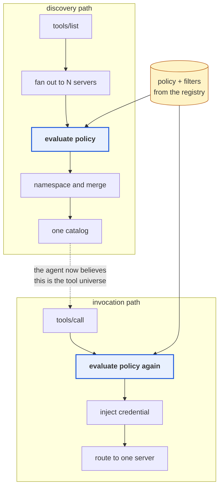

This is a two-path diagram rather than a single request flow, and the dotted arrow is a belief the
agent forms rather than a call it makes. **Both highlighted boxes read the same policy source, and
that shared origin - not the fact that there are two checks - is what makes the visible set and the
callable set provably the same.** It is drawn as two lanes fed by one store because the alternative
implementation, two independently maintained filters, would look almost identical in a diagram that
merged them, and the difference between those two designs is the entire point. Synthesized from
`n10`, `n12`, and `n3` for the registry as the policy origin.

Notice that this closes a gap which is genuinely easy to leave open, because the two paths feel like
different concerns. Listing feels like a catalog problem and calling feels like a security problem,
and a team that reasons that way ships exactly the drift described above.

This is also where S29 lands in the same place as [S27](../260816_scaling-github-for-agents/LEARNING.md)
from the opposite direction, which is the most valuable corroboration in this ingest. **Claim 221**
records GitHub's finding that authorization data is a free, per-user, already-correct filter on the
tool surface, discovered from inside a server that was trying to shrink its catalog. DoorDash arrives
at the same coupling of authorization and tool visibility from outside, as a consumer trying to
govern servers it does not own. Two organisations, two vantage points, one conclusion, which is that
the authorization decision and the catalog decision are the same decision.

**Claim 224** gets a second instance here too, and a weaker one worth labelling. GitHub constructs a
new server instance per request so the tool surface can be assembled per caller. DoorDash's bundle
fan-out is also per-request catalog assembly, one layer up, though the source never says whether the
fan-out is cached or live and the figure's "cached catalog" arrow suggests it may not be as live as
the picture implies [n4]. Treat it as convergent architecture rather than as a replication.

The source's own generalisation is the sentence to carry away, and it deserves to be read as an
instruction rather than an observation. The discovered tool catalog is an interface, which means
names, descriptions, filtering, grouping and audience all matter [n13]. An interface has an author, a
version, and a person accountable for whether it is any good. A projection of whatever four servers
happened to publish has none of those things.

## Movement D - operating it, and reading it honestly

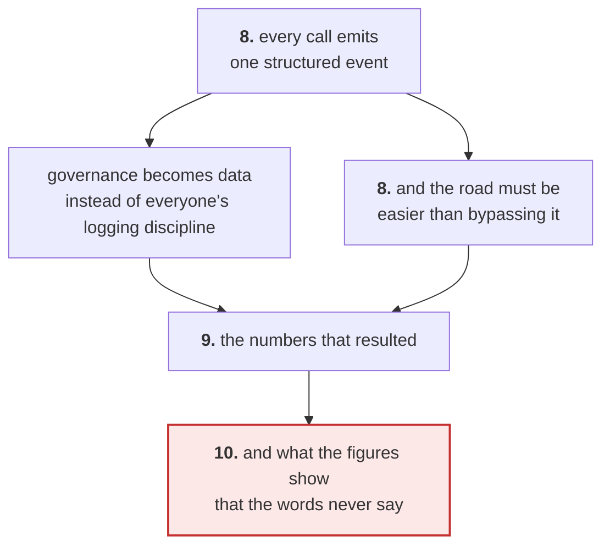

This is a reading-posture diagram rather than a mechanism one, so the final box is not a component of
the gateway but a change in how you should treat the source. **The movement moves from what the
platform records, through what it reported, to what it did not report, and the last step is where
this note stops agreeing with S29.** It narrows to a single red terminus because the two findings
there are the only claims in this note that the source would not endorse. Synthesized from `n14`,
`n16`, `n17`, `n4`.

### 8. Governance as data, and the adoption test

Because every call traverses one component, every call can emit one structured event, and the field
list is worth reading as a design statement rather than as telemetry. Each event carries the server,
tool, bundle and owning team, the user, agent, service and platform, the authorization result, status
code, error source and latency breakdown, request and response size, and downstream-reported cost
metadata where the downstream provides it [n14].

Look at what is in that tuple that a normal request log would not have. The **bundle** is there, so
you can attribute usage to a curated surface rather than only to a server. The **owning team** is
there, so cost lands on somebody. The **authorization result** is there, so refusals are data rather
than silence. And the **agent** is distinguished from the **user** and from the **service**, which is
the distinction the whole platform exists to preserve. The source's summary of this is that the
gateway turns governance into data instead of relying on every team to log the right fields [n14].

The most quietly instructive operational detail is that new rate limits can run in **shadow mode**
before enforcement, showing what would have been rejected without breaking production traffic [n15].
This is a single unevidenced sentence, so weight it lightly as evidence about DoorDash, but the
technique matters because it is what makes a limit on shared infrastructure adoptable at all. A limit
you cannot preview is a limit nobody will let you turn on.

That handles whether the platform can see what happens. It does not answer the prior question, which
is why anybody routes through it in the first place, and the source is unusually clear-eyed about
this. A gateway only works if teams prefer it to bypassing it [n17]. Registration, discovery,
filtering and bundle management are therefore all self-serve through a control-plane UI and API,
and the onboarding loop runs from registering a server, discovering its raw catalog through
`tools/list`, selecting and approving tools, attaching auth mode and ownership and policy, adding
approved tools to bundles, and then watching traffic and errors and cost [n17].

The two sentences that state the principle are the ones to remember, because they invert how
governance is usually argued. Governance that requires tickets does not scale, and the paved road has
to be easier than copying a secret into an agent and connecting directly to a server [n17]. **The
competitor to your platform is not another platform. It is fifteen minutes and a hardcoded token.**
Notice that this reframes a policy problem as a product problem, and it means an unusable governed
path is not a partial success but a net negative, since it produces both the platform's cost and the
ungoverned traffic.

So the question becomes whether the road was in fact easier, and the article answers with numbers.

### 9. The numbers, and what they do not measure

The adoption block reports more than 200 MCP servers registered behind the gateway, together exposing
thousands of tools curated into approved subsets. More than 30 agents and services, used by thousands
of employees, reach those tools through it, and none of them handle raw credentials. Millions of tool
calls a week are routed, each authenticated, authorized and recorded. Registering a new server is
said to take minutes [n16].

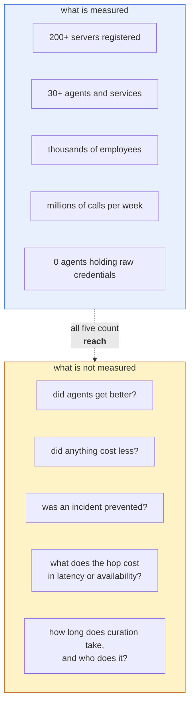

This is an evidence-audit diagram rather than a results chart, so the left column is not a scoreboard
and the right column is not a criticism of the platform. **Every reported number counts how far the
platform spread, and none reports what changed because it spread, which is the distinction between
adoption and outcome.** The two columns are deliberately the same height because the omissions are as
structured as the measurements, and drawing the right column smaller would imply the gaps are
incidental when they are systematic. Synthesized from `n16`, and the right-hand column is entirely
this brain's reading.

Read the fifth measured item carefully, because it is the strongest one and it is a different kind of
claim from the other four. Zero agents holding raw credentials is a statement about a property
holding across a population, and it is the only reported figure that would be falsified by a single
counterexample. The other four would all still be true if the platform were achieving nothing.

The claim most worth being sceptical about is that registering a server "takes minutes", because it
sits directly beside the manual approval step. Registering the server may well take minutes.
Deciding which of a third-party server's several hundred tools DoorDash is willing to expose is a
different activity, performed by a different person, and the source folds both into one onboarding
loop without separating their costs.

None of this makes the design suspect. It makes the evidence thin in a specific and predictable
direction, which is the direction an engineering-brand post is always thin in. The architecture is
the contribution here and the numbers are the marketing, and reading them as different classes of
material is the right posture. What raises confidence in the design is not DoorDash's numbers at all
but the fact that GitHub reached overlapping conclusions from the opposite side of the same protocol.

There is one more class of material in this source, and it is the class nobody wrote deliberately.

### 10. What the figures say that the prose does not

Two things appear in Figure 1 that are absent from every sentence of the article, and both change
what the architecture means. They are recorded in `nodes.md` as divergences rather than as claims,
because a figure-only finding cannot be promoted as a statement about what DoorDash built.

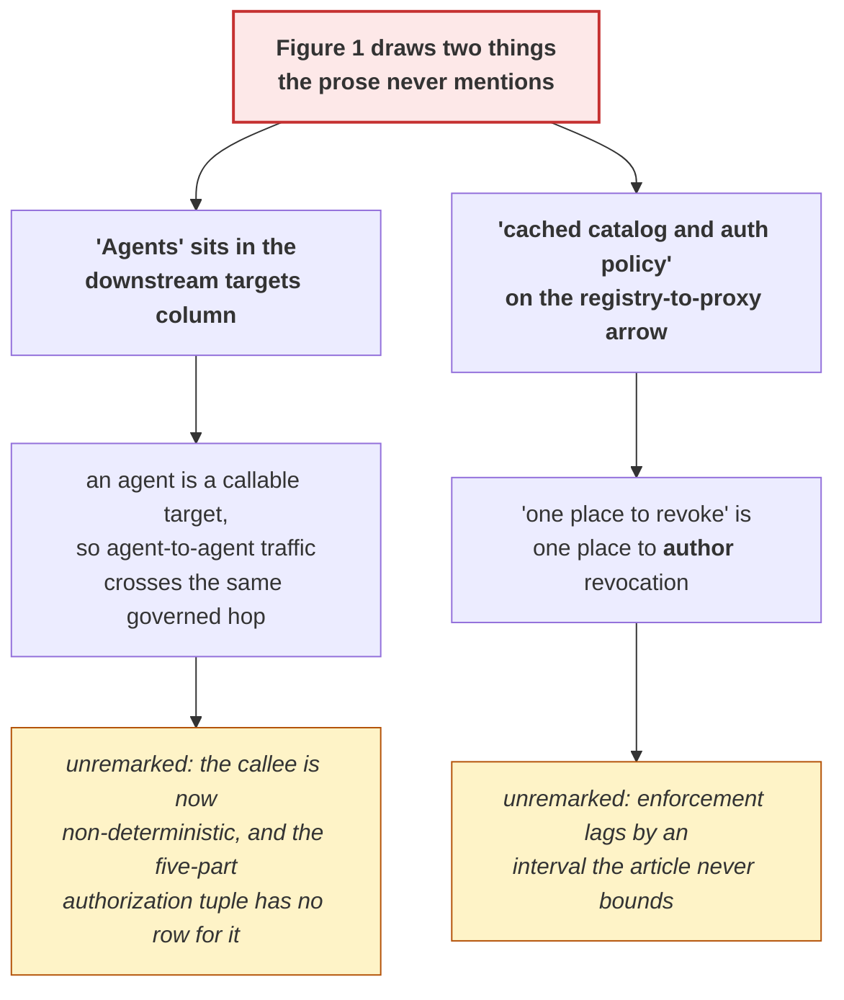

This is a gap diagram rather than a design one, so the yellow boxes are questions the source leaves
open and not features it built. **Both findings follow the same pattern, which is that a figure drawn
by an engineer contains an operational truth that the prose, written in a promotional register,
smooths away.** It is drawn as two independent branches from one root because the two gaps share a
cause and nothing else, and connecting them would imply a relationship that does not exist.
Synthesized from `n4` and the divergence table in [`nodes.md`](nodes.md); the consequences in the
yellow boxes are this brain's inference and S29 makes no statement either way.

Take the first one. The right-hand column of Figure 1 is headed "downstream targets" and contains
internal MCP servers, third-party MCP servers, and agents [n4 context, and the divergence table].
The article discusses downstream exclusively as MCP servers and never once mentions calling an agent.
If the figure is accurate, then agents are registered as callable targets, and agent-to-agent
invocation traverses the same governed path as any tool call. That is a significant architectural
statement, and it is the sort of thing you would expect a post to lead with rather than leave in a
box.

Why does it matter rather than merely being an omission? Because every control described in this
article assumes the callee is deterministic. A filter that removes `repo__delete_branch` from a
catalog works because the GitHub server will not do something the agent did not ask for. An agent as
a downstream target has no such property. It receives a request, reads it, and decides what to do
next, which means the five-part authorization tuple in section 3 has no row for the case where the
thing you authorized is a thing that will itself decide. The source neither claims this nor addresses
it, so this is flagged as an open question rather than a criticism.

The second finding is smaller and more immediately practical. The arrow from registry to proxy is
labelled "cached catalog and auth policy" [n4], while the prose states without qualification that
DoorDash has "a single place to change access and revoke it" [n6]. Both are true and they are in
tension. Revocation is centrally *authored* in the registry and eventually *enforced* at the proxy,
with a propagation window the article never bounds.

This is not an error the authors made, and it is worth saying so plainly, since every distributed
policy system caches and the alternative would put the registry on the hot path of every call. It is
a detail that the register of an engineering-brand post elides, and it is precisely the first
question a security reviewer would ask, because the answer determines whether revoking a compromised
agent's access takes effect in a second or in an hour. Neither leg of this source gives that number.

The general lesson from both findings is one this kit is built around and is worth stating in its own
right. **The figures in an engineering post are drawn by the engineer and the prose is edited for the
brand, so the picture routinely carries operational truth the text has smoothed away.** Reading them
against each other is not pedantry. On this source it produced the two most interesting findings in
the ingest, and neither was available from either leg alone.

## Diagram (mental model)

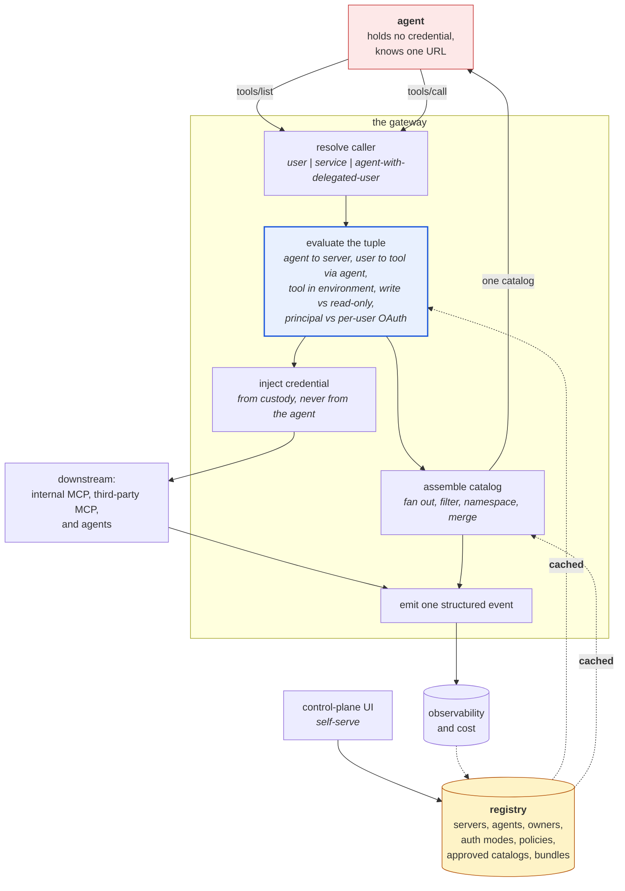

This is a mechanism diagram, and it is deliberately not the architecture diagram the source drew,
because Figure 1 shows only the invocation pipeline and Figure 3 shows only the discovery path, and
the thing you actually need to hold in your head is how one policy evaluation serves both.

**The single idea is that identity is resolved once and then feeds two different consumers - the
catalog assembler and the credential injector - which is why the tool an agent can see and the
credential the call carries can never disagree.**

It is shaped with the policy box as a hub rather than as a step in a line because a linear pipeline,
which is how Figure 1 draws it, makes the discovery path look like a separate feature. Draw it that
way and a reader builds the version of this system where filtering and authorization are two
subsystems, which is the exact failure section 7 describes. The registry is coloured as a store and
its two arrows are dashed and labelled cached, because that is the honest depiction of a control
plane read through a cache and it is the detail Figure 1 states and the prose omits. The agent sits
outside the boundary in a third colour to keep the custody claim visible, since the whole design
collapses the moment that box holds a token.

Synthesized from `n3`, `n5`, `n6`, `n10`, `n12`, `n14`, with the cache from `n4`. The two-consumer
framing of the policy step is this brain's reading, not the source's.

## 💡 Terms

| Term | Meaning |
|---|---|
| **MCP** | Model Context Protocol. A client-server protocol for describing, discovering and invoking tools. `tools/list` returns the catalog, `tools/call` invokes one. |
| **Elicitation** | An MCP capability letting a server ask the connected client to collect something from the human mid-request. Optional, so a client may not implement it. |
| **Agent Gateway** | DoorDash's name for the governed entry point that all agent-tool traffic crosses. A proxy on the data path plus a registry holding control-plane truth. |
| **Bundle** | One logical MCP endpoint whose catalog is assembled from several downstream servers. Composition across servers. |
| **Filter** | A rule deciding which of a server's tools are exposed for a given bundle, agent, user group, environment or audience. Subtraction within a server. |
| **Aggregating server** | Any MCP server whose tools come from other servers. Because clients see only the aggregator's `tools/list`, it can add, hide, rename or re-index freely. |
| **Data plane / control plane** | The component traffic flows through, versus the component that decides what it should do. Split so policy can change without a deploy. |
| **Service principal** | A non-human identity owning permissions in its own right, so team automation does not run on a person's grant. |
| **Refresh token** | A long-lived credential used to mint short-lived access tokens. Holding one is close to holding the account. |
| **Shadow mode** | Running a rate limit in evaluate-and-record mode without enforcing it, to see what it would have rejected. |

## What to distrust in this note

**The source tier, and what follows from it.** This is a first-party vendor engineering post on a
careers site, written by the team that built the thing, with job listings under it. That is roughly
T4 material on this kit's scale, which means use it for design ideas and never as evidence about
outcomes. There is no external audit, no third-party measurement, and no comparison against what it
replaced.

**Every reported number counts reach, not outcome.** Section 9 makes this case in full and it is the
single most important caveat here. Servers registered, agents connected, employees served and calls
routed would all be identical in a world where the gateway made agents worse, more expensive and
equally insecure. The one figure with real content is that no agent holds a raw credential, because
it is a property claim that one counterexample would break.

**The most reusable claims in this note are among the least corroborated.** That inversion is worth
stating plainly. The two most transferable ideas here are that missing grants are normal states
rather than exceptions [n9] and that the governed path must win on convenience [n17]. Both are
`corroborated` internally in the weak sense that a figure agrees with the prose, and neither has any
external evidence at all. They are compelling because they generalise, and generalising well is not
the same as being demonstrated.

**Two claims in this note are figure-only and cannot be attributed to DoorDash's prose.** The
agents-as-downstream-targets finding and the cached-policy finding both come from reading Figure 1
against the text [n4]. The figure is unambiguous, but a diagram is a simplification made by one
person, and it is entirely possible that "Agents" in the downstream column is loose drafting rather
than an architectural statement. Section 10's consequences are labelled as this brain's inference for
that reason.

**The corroboration with S27 is real and should not be overcounted.** Claims 221 and 224 gain a
genuinely independent second vantage here, which is worth a lot, because the organisations,
motivations and layers differ. What they do not gain is a second measurement. S27 published numbers
and S29 published a design that agrees with them. Convergent design is weaker evidence than
replication, and this note has been careful not to let the agreement inflate either side.

**The visual leg on this source is unusually strong, which is a fact about the source.** All three
figures were kept, all three carry content the prose does not, and two of them were more specific
than their own captions. That is not a signal about the gate working harder than usual. It is what
happens when a source ships purpose-drawn diagrams rather than screenshots, and it should not be read
as a general expectation for blog sources.

## Open questions

These are the deep-research backlog for this source, ordered by what would most change the reading.

1. **What is the revocation propagation window?** The cache in Figure 1 makes "one place to revoke" a
   claim about authorship rather than enforcement [n4]. The answer decides whether this is a security
   control or a governance convenience. Nothing in the source bounds it.
2. **Are agents genuinely registered as downstream targets, and if so what governs a non-deterministic
   callee?** Every control in the article assumes the thing being called does what it is asked. The
   five-part authorization tuple has no row for the case where the callee decides for itself.
3. **What does the hop cost?** No latency, no availability figure, no failure behaviour. A component
   on the path of millions of weekly tool calls has an availability number, and its absence in a post
   that reports call volume is conspicuous.
4. **Who performs the curation, and how does it keep up?** Approving tools per server is manual
   [n17], and 200-plus servers exposing thousands of tools [n16] implies a standing workload. What
   happens when a third-party server ships new tools nobody has reviewed?
5. **What proportion of clients support elicitation?** The good path in Figure 2 requires it, and the
   fallback is described in one sentence with no evidence [n8]. This determines whether the headline
   improvement reaches most users or a minority.
6. **What did the usage events actually reveal?** The event schema is rich [n14] and the article
   reports no finding from it. A platform that instruments everything and publishes no observation is
   either not yet analysing, or analysing and not telling.
7. **"Checks for risky tool descriptions" is a one-line roadmap item with large implications.** It
   implies the gateway will police a field written by downstream authors, which is a content-policy
   problem wearing a platform hat. Related to claim 220 and to the description-as-attack-surface
   material in the agent-security note.

## Feeds these topics

- [**mcp**](../../brain/topics/mcp.md) - the second data point on aggregating servers as this
  protocol's leverage point, the catalog-as-interface framing, and per-request catalog assembly as a
  second instance of claim 224.
- [**agent-security**](../../brain/topics/agent-security.md) - credential custody as a design
  boundary, the five-part authorization tuple, filtering as a containment control that works without
  model cooperation, and the cached-revocation gap.
- [**agents**](../../brain/topics/agents.md) - task-shaped tool surfaces rather than server-shaped
  ones, and the platform-adoption principle that a governed path must beat the ungoverned one on
  convenience.

## Presentation narrative

> Persona: **presenter**. Audience: engineering leadership plus the platform and security leads who
> would own this if it were built here. Roughly 12 minutes.
>
> **Framing note before slide 1.** This is not a recommendation to build a gateway. It is a report on
> what a company with roughly 200 tool servers found out about a problem we currently have at a
> smaller scale, and the useful part is which problem they found, not what they built. I will be
> explicit about which of this is evidence and which is design taste, because the source mixes them.

### Slide 1 - The protocol we adopted solved the part that was already easy

**MCP standardised how a tool call is described and invoked, and left every question that decides
whether the call should happen outside the specification.** DoorDash lists six. Which agent may call
this tool. Whom is it acting for. Which credential should be attached. Which tools should it even
see. How is access withdrawn. What record survives.

Not one of those is answerable by a wire format, and a protocol that tried would be unimplementable
by anyone whose authorization model differed. This is not a defect in MCP. It is work that adopting
MCP does not reduce, and it surprises people only because the integration got easy first.

The obvious objection is that we could answer them where we already work, and each version fails
differently. In the agent, the enforcement point becomes a prompt. In each server, every author
reimplements identity and the third-party servers we most want to call never encode our org chart.
In a shared library, it reaches only the teams that upgrade it and nobody can revoke anything.

This is a pipeline diagram rather than a component diagram, and it is worth reading as a ratio.
**The only step the protocol defines is one of five.** *Provenance: `visuals/fig1_gateway-architecture.jpg`,
n1, n2, claim 232.*

### Slide 2 - The tool catalog is an interface, and right now nobody here owns it

**This is the transferable finding, and it holds whether or not we ever build a gateway.** Agents do
not think in servers, they think in tasks. A coding agent investigating an incident wants one surface
to work from, not four separate setup steps. Servers are organised by who built them and tasks by
what someone is doing, and those two decompositions have no reason to agree.

DoorDash composes across servers and subtracts within them, so one endpoint returns one merged
catalog, filtered per tool.

This is a curation diagram, not an architecture one, so the instructive part is the struck-through
names rather than the boxes. Deletes, transfers, reindexes, permission changes. **The filter is drawn
around irreversibility and authority, not around relevance,** which is a far sharper instruction than
"expose fewer tools" and the sort of thing only a worked example makes visible.
*Provenance: `visuals/fig3_bundles-and-filtering.jpg`, n10, n11, claim 233.*

### Slide 3 - Filtering the list is only half a control

**A client will not call a tool that was not in the list it received, so the catalog is a containment
boundary that works without the model cooperating.** That holds only if the same policy governs the
call, and DoorDash evaluates authorization on the discovery fan-out and again on invocation, from one
source.

Why insist on the shared source rather than simply two checks? Two independently maintained filters
look identical on a whiteboard and drift within a quarter, and sharing an origin is what makes the
visible set and the callable set provably the same.

This is also where the evidence gets genuinely strong, and it is the one place I would defend citing
this post. GitHub reached the same coupling from inside a server trying to shrink its own catalog.
DoorDash reached it from outside, governing servers it does not own. **Two organisations, opposite
vantage points, same conclusion,** which is worth more than either company's numbers.
*Provenance: `visuals/fig3_bundles-and-filtering.jpg` read for its authorization step, n11, n12,
claim 234 as a second vantage on claim 221.*

### Slide 4 - A missing authorization is a state, not an error

**This is the design move I would steal first, and it costs nothing to adopt.** When a user-scoped
tool needs an authorization nobody has granted yet, the gateway holds the call open, prompts inside
the protocol with a connect URL, takes the callback, and then issues the original call with the
user's token attached.

This is a sequence diagram, and the load-bearing step is the replay rather than any of the arrows. It
does not tell the client to try again. A retry requires the agent to still be holding its intent, and
intent between turns is exactly what decays. Their own figure puts it best: a dropped turn becomes a
seamless prompt.

Take it away from OAuth and it is a rule about categories. **When a condition occurs on a large
fraction of first uses, treating it as an error is a category mistake,** and the fix is to give it a
place inside the protocol rather than a better message.
*Provenance: `visuals/fig2_elicitation-handshake.jpg`, n7, n9, claim 235. The fallback for clients
without elicitation is stated once and never quantified.*

### Slide 5 - The competitor to a governed path is fifteen minutes and a hardcoded token

**Their stated adoption test is that governance requiring tickets does not scale, and the paved road
has to be easier than copying a secret into an agent.** Registration, tool discovery, filtering and
bundle management are all self-serve for that reason.

The leadership significance is that this reframes a policy question as a product question. A governed
path slower than bypassing it does not buy partial compliance. It buys the platform's cost and the
ungoverned traffic both, which is worse than not building it.

Read the same picture for its lower left rather than its centre. The control plane is drawn as a
component with its own interface rather than as an admin afterthought, and that placement is the
argument. **The competitor is not another platform.**
*Provenance: `visuals/fig1_gateway-architecture.jpg`, control-plane row, n17, claim 237 generalising
claim 217.*

### Slide 6 - What the numbers say, and what their own diagram says that they do not

**They report 200-plus servers, 30-plus agents, thousands of employees, millions of calls a week, and
no agent holding a raw credential. Four of those five measure reach and none measures outcome.**
Nothing says agents got better or an incident was prevented, and all four would read identically in a
world where the platform achieved nothing. The fifth is the one I would quote, because zero agents
holding raw credentials is a property that a single counterexample breaks.

I want to close on two things their own diagram says that their text does not, because we found both
by reading the picture against the prose. **Agents** sit in the downstream-targets column, which
would put agent-to-agent calls on the same governed hop, and the post never addresses a callee that
decides for itself. And the arrow feeding policy to the proxy is labelled **cached**, which turns one
place to revoke into one place to *author* revocation with a lag nobody bounds. Neither is a
criticism of their engineering. Both are the first questions a security review asks.
*Provenance: `visuals/fig1_gateway-architecture.jpg` read against the prose, n4, n16, claim 238.*

### Key takeaway message

**The decision this evidence supports is not to build a gateway. It is to name an owner for the tool
catalog, and to find out what our revocation window currently is.**

I want to be honest that the null result is the honest one here. We do not have 200 tool servers and
we do not have the problem this platform solves. What we do have is the smaller version of it, which
is a set of tool surfaces that nobody authored, assembled by whoever wired up each agent, with
credentials in places we have not enumerated. **Every reusable idea in this post applies at our scale
and none of the machinery does.**

So two things, and both are cheap. First, treat the tool catalog as an interface with an author,
starting with a single question asked of each agent we run, which is who decided this agent can see
these tools. Second, answer the question their figure raised on us rather than on them. If we
revoked an agent's access to a downstream system right now, how long until that took effect, and does
anyone know?

**What would change this recommendation is scale, and the threshold is legible.** When tool surfaces
are being assembled by more teams than one person can name, the per-team cost of access, curation and
operations starts recurring, and that is the point at which relocating it to a hop stops being
premature. We are not there. We should know when we arrive.
