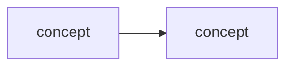

# Learning - <TITLE>

> Persona: **curator** (media) / **code-explorer** (code) **+ mentor, always**. Re-adopt when working
> this file. Mentor is not conditional here: this document exists to be *learned from*, so the
> teaching voice is the default and not a mode you switch on. Add **fact-checker** at the gate and
> **architect** when mapping which topics this feeds.

> The distilled document you learn from - text anchored by a few curated visuals. Built from the
> corroborated nodes in `nodes.md`. Every claim is cited. Signal, not archive (3-8 visuals, not
> hundreds). See `SOURCE.md` for metadata.

> **Voice: an AI architect ramping up a new senior engineer.** Not a summary of the source, and not
> notes for someone who already sat through it. Your reader is strong, will not need hand-holding on
> engineering, and **has never met this subject** - so give them the mental model and the design
> rationale, not steps. They should finish able to *hold* the subject and argue about it.
>
> Two consequences of that reader being **senior**, and they are what make the voice specific:
> - **Earn every claim.** They will push back, so weak evidence must be labelled where it is used,
>   not buried in a caveat at the end. Say what the source did *not* establish.
> - **Teach judgement, not topology.** They can infer the mechanics; what they cannot infer is why
>   the boundary sits there, which part is expensive, and what breaks at scale.
>
> **Calibration: enough fundamentals, never 101.** Teach every fundamental *the subject itself*
> needs - OAuth's front channel vs back channel, what `tools/list` costs, what a cross-encoder is -
> and none of the field's ("what is a token", "what is an LLM"). If the source assumes knowledge its
> reader will not have, supply it; if the field already assumes it, do not.
> *(Distinct from the deep-research calibration in `AGENTS.md`, which aims one level **above** the
> source. That is for `context/` notes; this is for the source's own subject.)*

## TL;DR

<2-4 sentences: what this source teaches and why it is worth knowing.>

## Key claims

- <Claim 1.> `<citation>`
- <Claim 2.> `<citation>`
- <Claim 3.> `<citation>`

## Walkthrough

<The distilled narrative - the mental model and the crux, in order. Anchor the key moments to
their visuals below. Use `> 💡 <term>` explainers for new concepts (mentor persona).>

<!-- Order it as a RAMP, not as the source's running order. The source's order optimises for its own
     talk or article; yours optimises for a senior engineer holding the subject at the end. The shape
     that has worked here (see 260725_12-factor-agents):

       1. Why you should care - the problem or failure that makes this subject worth an hour.
          Concrete and personal beats abstract: "you will hit a 70-80% wall" beats "reliability
          matters".
       2. The fundamentals this subject needs, in DEPENDENCY order - each one a `###` section, only
          the ones the subject actually requires.
       3. The crux - the idea everything above was setting up.
       4. The consequences - what it changes about how you build, and what it rules out.

     Delete this comment; keep the shape. -->

### Why you should care: <the failure or cost this subject exists to prevent>

<The concrete problem a senior engineer will recognise or soon hit. This section is why they keep
reading; it is not optional and it is not a restatement of the TL;DR.>

### <Key visual 1 - what it shows>

- What it teaches: <crux>. `<citation with &t=...>`
- Corroborated by: "<the text/transcript quote>".

### <Key visual 2 - what it shows>

- What it teaches: <crux>. `<citation>`

## Diagram (mental model)

<!-- Every diagram carries a walkthrough - see AGENTS.md "Every diagram carries a walkthrough".
     Write it as a mentor ramping up an engineer. Delete these four labels, keep the substance. -->

**How to read it:** <direction of flow; what the shapes and colours mean; a legend if colour carries
meaning.>

**The crux: <the one idea this diagram exists to convey - if you cannot say it in one sentence,
delete the diagram.>**

**Why it is shaped this way:** <the design rationale, and what would go wrong with a different shape.
This is the part that teaches judgement rather than topology. Do NOT narrate the arrows - the reader
can see those. Explain what they cannot see: why the boundary sits there, which box is expensive,
what breaks at scale.>

*Synthesized from `n<x>`, `n<y>`.* <or the normal citation if the diagram was lifted from the source.>

## 💡 Terms

| Term | Explanation |
|---|---|
| <term> | <1-2 sentence 💡 definition> |

## Open questions / confidence

- <Anything flagged needs-check or open-question, with why.>

## Feeds these topics

- `../../brain/topics/<topic>.md` - <which claims were promoted>
