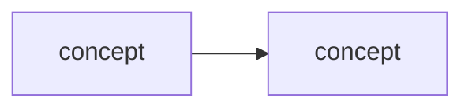

# Learning - <TITLE>

> Persona: **curator** (media) / **code-explorer** (code) **+ mentor, always**. Re-adopt when working
> this file. Mentor is not conditional here: this document exists to be *learned from*, so the
> teaching voice is the default and not a mode you switch on. Add **fact-checker** at the gate and
> **architect** when mapping which topics this feeds.

> The distilled document you learn from - text anchored by a few curated visuals. Built from the
> corroborated nodes in `nodes.md`. Every claim is cited. Signal, not archive (3-8 visuals, not
> hundreds). See `SOURCE.md` for metadata.

## TL;DR

<2-4 sentences: what this source teaches and why it is worth knowing.>

## Key claims

- <Claim 1.> `<citation>`
- <Claim 2.> `<citation>`
- <Claim 3.> `<citation>`

## Walkthrough

<The distilled narrative - the mental model and the crux, in order. Anchor the key moments to
their visuals below. Use `> 💡 <term>` explainers for new concepts (mentor persona).>

### <Key visual 1 - what it shows>

- What it teaches: <crux>. `<citation with &t=...>`
- Corroborated by: "<the text/transcript quote>".

### <Key visual 2 - what it shows>

- What it teaches: <crux>. `<citation>`

## Diagram (mental model)

<!-- Every diagram carries a walkthrough - see AGENTS.md "Every diagram carries a walkthrough".
     Write it as a mentor ramping up an engineer. Delete these four labels, keep the substance. -->

**How to read it:** <direction of flow; what the shapes and colours mean; a legend if colour carries
meaning.>

**The crux: <the one idea this diagram exists to convey - if you cannot say it in one sentence,
delete the diagram.>**

**Why it is shaped this way:** <the design rationale, and what would go wrong with a different shape.
This is the part that teaches judgement rather than topology. Do NOT narrate the arrows - the reader
can see those. Explain what they cannot see: why the boundary sits there, which box is expensive,
what breaks at scale.>

*Synthesized from `n<x>`, `n<y>`.* <or the normal citation if the diagram was lifted from the source.>

## 💡 Terms

| Term | Explanation |
|---|---|
| <term> | <1-2 sentence 💡 definition> |

## Open questions / confidence

- <Anything flagged needs-check or open-question, with why.>

## Feeds these topics

- `../../brain/topics/<topic>.md` - <which claims were promoted>
