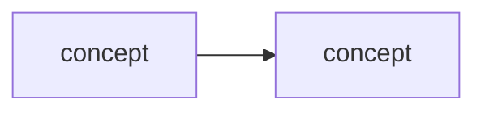

# Learning - <TITLE>

> Persona: **curator** (media) / **code-explorer** (code) - + mentor when teaching. Re-adopt when working this file.

> The distilled document you learn from - text anchored by a few curated visuals. Built from the
> corroborated nodes in `nodes.md`. Every claim is cited. Signal, not archive (3-8 visuals, not
> hundreds). See `SOURCE.md` for metadata.

## TL;DR

<2-4 sentences: what this source teaches and why it is worth knowing.>

## Key claims

- <Claim 1.> `<citation>`
- <Claim 2.> `<citation>`
- <Claim 3.> `<citation>`

## Walkthrough

<The distilled narrative - the mental model and the crux, in order. Anchor the key moments to
their visuals below. Use `> 💡 <term>` explainers for new concepts (mentor persona).>

### <Key visual 1 - what it shows>

- What it teaches: <crux>. `<citation with &t=...>`
- Corroborated by: "<the text/transcript quote>".

### <Key visual 2 - what it shows>

- What it teaches: <crux>. `<citation>`

## Diagram (mental model)

## 💡 Terms

| Term | Explanation |
|---|---|
| <term> | <1-2 sentence 💡 definition> |

## Open questions / confidence

- <Anything flagged needs-check or open-question, with why.>

## Feeds these topics

- `../../brain/topics/<topic>.md` - <which claims were promoted>
