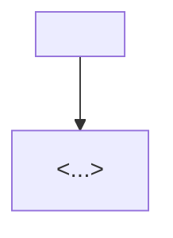
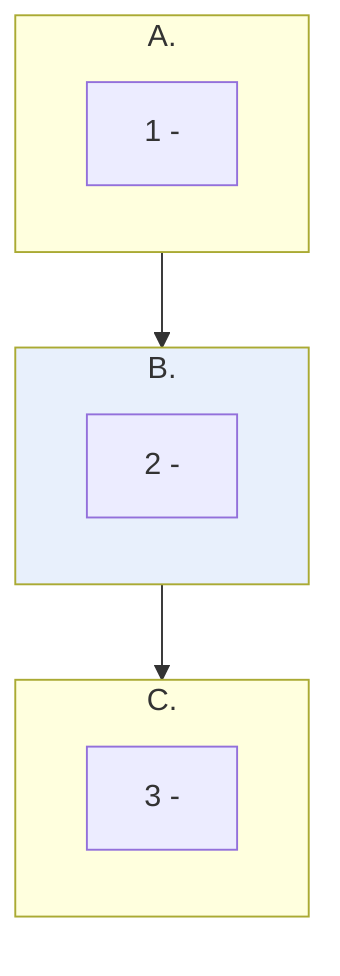
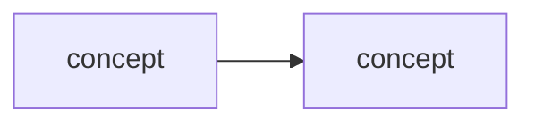

# Learning - <TITLE>

> Persona: **curator** (media) / **code-explorer** (code) **+ mentor, always**. Re-adopt when working
> this file. Mentor is not conditional here: this document exists to be *learned from*, so the
> teaching voice is the default and not a mode you switch on. Add **fact-checker** at the gate and
> **architect** when mapping which topics this feeds.

> The distilled document you learn from - text anchored by a few curated visuals. Built from the
> corroborated nodes in `nodes.md`. Every claim is cited. Signal, not archive (3-8 visuals, not
> hundreds). See `SOURCE.md` for metadata.

> **Voice: an AI architect ramping up a new senior engineer.** Not a summary of the source, and not
> notes for someone who already sat through it. Your reader is strong, will not need hand-holding on
> engineering, and **has never met this subject** - so give them the mental model and the design
> rationale, not steps. They should finish able to *hold* the subject and argue about it.
>
> Two consequences of that reader being **senior**, and they are what make the voice specific:
> - **Earn every claim.** They will push back, so weak evidence must be labelled where it is used,
>   not buried in a caveat at the end. Say what the source did *not* establish.
> - **Teach judgement, not topology.** They can infer the mechanics; what they cannot infer is why
>   the boundary sits there, which part is expensive, and what breaks at scale.
>
> **Calibration: enough fundamentals, never 101.** Teach every fundamental *the subject itself*
> needs - OAuth's front channel vs back channel, what `tools/list` costs, what a cross-encoder is -
> and none of the field's ("what is a token", "what is an LLM"). If the source assumes knowledge its
> reader will not have, supply it; if the field already assumes it, do not.
> *(Distinct from the deep-research calibration in `AGENTS.md`, which aims one level **above** the
> source. That is for `context/` notes; this is for the source's own subject.)*

## TL;DR

<2-4 sentences: what this source teaches and why it is worth knowing.>

<One compact paragraph, flowing prose, no labelled blocks: how to read it, the crux in one bold
sentence, why this shape rather than another, and provenance. Four or five sentences.>

<!-- The TL;DR diagram: the whole note in one glance, for a reader deciding whether to spend twenty
     minutes. It is lifted onto the landing page with this section, so keep it phone-sized and prefer
     flowchart TB.

     THE TRAP: this must not be the roadmap (reading order) or the mental model (how the subject
     works). Draw the note's THESIS, not its subject - if the walkthrough keeps saying two things get
     mistaken for each other, draw the pairs. See AGENTS.md "The TL;DR diagram".

     Delete this block and the fence above if the argument has no shape worth drawing. That is a legal
     outcome and needs no note - same conditional the mental model carries. -->

## The 1-minute version

| | |
|---|---|
| **The problem** | <what is actually hard, in one or two sentences> |
| **Why the obvious answer fails** | <the naive approach and the specific way it breaks> |
| **The idea** | <the crux, stated plainly> |
| **How it works** | <the mechanism, compressed> |
| **What it costs** | <the trade the design makes, and what it rules out> |
| **How far to trust it** | <evidence class in one line: measured? third-party? vendor self-report?> |

<!-- The whole argument in ~60 seconds. NOT a teaser - a reader who stops here should have the
     argument. Rows are adaptable to the source; keep each to a sentence or two. If a row cannot be
     filled without the walkthrough, the row is wrong. It is also a design check on you: an argument
     you cannot compress into six rows is usually one you have not finished deriving. -->

## Key claims

- <Claim 1.> `<citation>`
- <Claim 2.> `<citation>`
- <Claim 3.> `<citation>`

## What you will learn, and in what order

<!-- A roadmap of the walkthrough, grouped into movements, with a colour on the movement carrying the
     core technique. It exists so the reader knows the shape before committing - and writing it is
     the cheapest check that the walkthrough HAS a shape. Carries a walkthrough like any diagram:
     say which movements may be skimmed and which is the payload. Mark it synthesized. -->

## Walkthrough

<The distilled narrative - the mental model and the crux, in order. Anchor the key moments to
their visuals below. Use `> 💡 <term>` explainers for new concepts (mentor persona).>

<!-- NUMBERED SECTIONS, TITLED BY WHAT YOU LEARN. Their shape follows the SOURCE's own logic - do
     not force every source into one fixed outline. What is required is the six properties, from
     AGENTS.md "Writing a LEARNING.md (the required shape)". In brief:

       1. IT FLOWS. Each section ends by raising the question the next one answers; each opens by
          picking up what the last established. This is the one that separates a ramp from a wiki.
       2. IT IS VISUAL-LED. Built around the curated frames, one teaching step each, in order, with
          their "what it teaches" / "corroborated by" pair.
       3. IT PLANTS FORWARD AND PAYS OFF. Name a detail early, tell the reader to hold it, discharge
          it later.
       4. IT DERIVES RATHER THAN LISTS. Ask what the previous components structurally cannot answer
          and let each residual question name the next.
       5. FUNDAMENTALS GO INLINE WHERE NEEDED, marked "> **Background, supplied.**" and uncited by
          construction. NOT one Foundations block at the front.
       6. WEAK EVIDENCE IS LABELLED AT THE POINT OF USE (single-leg, vendor self-report,
          figure-only), never deferred to the end.

     Order for the reader who does not know it yet: open on why the subject is hard or what it
     costs, teach the thing once and properly, then let the variations become deletions from it.
     The anti-pattern is the PUNCHLINE OPENING - right for a TL;DR, wrong for everything after.

     Worked examples: 260725_closed-loop-evals-multimodal-agent (flow, three eval shapes),
     260725_oauth2-oidc-plain-english (forward planting, "What has aged"),
     260802_agent-data-stack (deriving a design one residual question at a time).

     Delete this comment; keep the properties. -->

### 1. <What the reader learns first - usually why this is harder than it looks, or what it costs>

<The concrete problem a senior engineer will recognise or soon hit. This section is why they keep
reading; it is not optional and it is not a restatement of the TL;DR.>

### <Key visual 1 - what it shows>

- What it teaches: <crux>. `<citation with &t=...>`
- Corroborated by: "<the text/transcript quote>".

### <Key visual 2 - what it shows>

- What it teaches: <crux>. `<citation>`

## Diagram (mental model)

<!-- Every diagram carries a walkthrough - see AGENTS.md "Every diagram carries a walkthrough".
     Write it as a mentor ramping up an engineer. Delete these four labels, keep the substance. -->

**How to read it:** <direction of flow; what the shapes and colours mean; a legend if colour carries
meaning.>

**The crux: <the one idea this diagram exists to convey - if you cannot say it in one sentence,
delete the diagram.>**

**Why it is shaped this way:** <the design rationale, and what would go wrong with a different shape.
This is the part that teaches judgement rather than topology. Do NOT narrate the arrows - the reader
can see those. Explain what they cannot see: why the boundary sits there, which box is expensive,
what breaks at scale.>

*Synthesized from `n<x>`, `n<y>`.* <or the normal citation if the diagram was lifted from the source.>

## 💡 Terms

| Term | Explanation |
|---|---|
| <term> | <1-2 sentence 💡 definition> |

## What has aged (read before applying)

<ONLY for dated sources. A per-recommendation table: what the source says, its status now, what to
do. State the generalisation: when a source ages the MECHANICS usually survive and the
RECOMMENDATIONS usually do not, because a recommendation encodes a trade-off against the
alternatives available at the time. Mark verdicts as commentary if they rest on background knowledge
rather than a cited source. Delete this section if the source is current.>

## What to distrust in this note

<Source-level trust, NOT claim-level caveats (those stay inline where used): tier and commercial
interest, sample size, what the figures do and do not measure, which of the note's most REUSABLE
claims are the least corroborated, and a line naming the "Background, supplied" blocks as yours and
uncited.>

## Open questions

- <Anything flagged needs-check or open-question, with why. This is the deep-research backlog.>

## Feeds these topics

- `../../brain/topics/<topic>.md` - <which claims were promoted>
