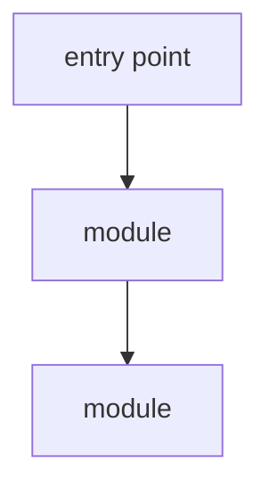
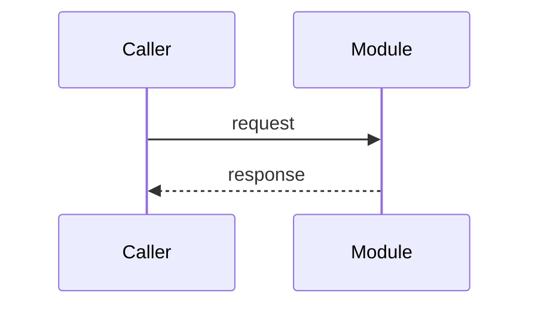

# Map - <REPO NAME>

> Persona: **code-explorer** (+ architect when mapping topics) - re-adopt when working this file.

> **Code sources only.** Repo orientation written by the **code-explorer** persona on a fresh
> clone, before deep tracing. The goal is to learn *what this repo demonstrates* and how to
> navigate it - not to read every line. See `SOURCE.md` for metadata (URL, commit SHA, license).

## What this repo demonstrates

<1-3 sentences: the transferable thing worth learning here, e.g. "a reference MCP server showing
how tool registration wires into a streaming HTTP request loop.">

## How to run / build (learning context only)

<The build/run story in brief - enough to understand the moving parts. We are learning, not
shipping.>

## Module map

| Path | Role |
|---|---|
| `src/<...>` | <what lives here> |
| `<...>` | <...> |

> The diagram is **generated from the code** and must match it (`path:line`). It is the code
> source's "visual leg" - corroborate it against the actual structure.

## Entry points

- `path:line @<sha>` - <what happens here>

## Key flow (the one worth tracing)

<Name the single most instructive flow and trace it end-to-end. Each hop cites `path:line @sha`.>

<!-- Every diagram carries a walkthrough - see AGENTS.md. Delete these labels, keep the substance. -->

**How to read it:** <direction of flow; what each participant is; a legend if colour or shape carries
meaning.>

**The crux: <the one thing this flow teaches about the repo - if you cannot say it in a sentence,
you have not finished tracing it.>**

**Why it is shaped this way:** <why the code is factored this way, what the boundaries buy, and what
would break if they moved. Do NOT narrate the arrows - explain what the reader cannot see from the
diagram: which hop is expensive, where the surprising indirection is, what the docs claim happens
here versus what the code actually does.>

*Generated from the code at `path:line @<sha>` - a diagram the repo does not contain.*

## Concepts to learn here (queue)

- [ ] <concept 1 - trace it, produce a node>
- [ ] <concept 2>

> Each concept, once traced and corroborated (docs↔code), becomes a node in `nodes.md` and, if
> transferable, is promoted to `../../brain/topics/*.md`.
